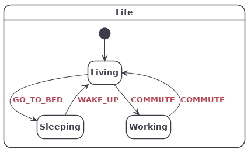

# sclang

## Introduction
sclang is a compact declarative language for state machine description. It comes with two tools:
* code: A C code generator to automatically generate the boilerplate code for the state machine logic. It generates simple, easy to read C99 code that only depends on <stdbool.h>.

* graph: A diagram generator to quickly validate and document the state machine design.

## Simple example
The snippet below:
```
/Life
Living
  @COMMUTE -> Working
  @GO_TO_BED -> Sleeping
Sleeping
  @WAKE_UP -> Living
Working
  @COMMUTE -> Living
```
will generate the following diagram:


and the following header file:
```c
/**
 * @file
 * Declarations for the Life statechart.
 * @note This file was automatically generated using sclang (https://github.com/alexis-boisserand/sclang).
 * Please don't edit it manually.
 */
#ifndef LIFE_H
#define LIFE_H
#include "life_definitions.h"

typedef enum
{
    LIFE_EVT_WAKE_UP,
    LIFE_EVT_GO_TO_BED,
    LIFE_EVT_COMMUTE
} life_event_t;

typedef enum
{
    LIFE_ST_LIVING,
    LIFE_ST_SLEEPING,
    LIFE_ST_WORKING
} life_state_t;

typedef struct
{
    life_state_t state;
} life_sc_t;

void life_init(life_sc_t* sc);
void life_handle_event(life_sc_t* sc, life_event_t evt);

#endif // LIFE_H
```

// installation

// usage

// concepts

- events

- guards

- hsm and paths

- actions

- targetless transitions

- transient state

// cmake integration