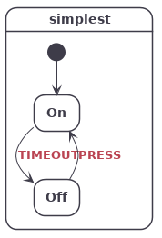

# sclang

## Introduction
sclang is a compact declarative language for state machine description. It is bundled with two tools:
* code: A C code generator that automatically generates all the boilerplate code related to the state machine logic,
allowing the developer to only focus on the actions of the system. The main target being reactive embedded systems,
 it generates simple, easy to read C99 code that only depends on <stdbool.h>.

* graph: A statechart diagram generator that allows to quickly validate and document the state machine design.


// made for embedded systems
// simple C code with no dependencies
// state machine correctness

## Simple example
```
/simplest
On
  @TIMEOUT -> Off
Off
  @PRESS -> On
```


// installation

// usage

// concepts

- events

- guards

- hsm and paths

- actions

- targetless transitions

- transient state

// cmake integration