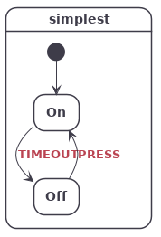

# sclang

## Introduction
sclang is a minimalistic declarative language for state machine description. It is bundled with two tools:
* graph: a statechart diagram generator
* code: a C code generator

The main target of sclang is embedded systems 

## Simple example

// installation

// usage

// concepts

- events

- guards

- hsm and paths

- actions

- targetless transitions

- transient state

// cmake integration